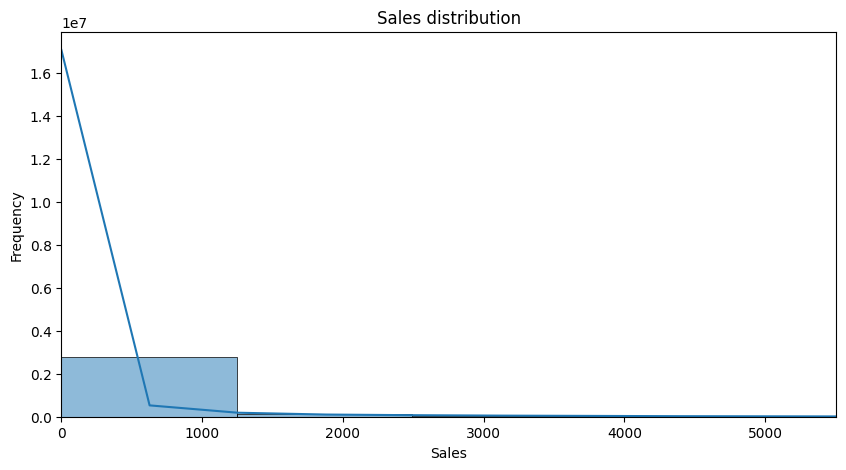
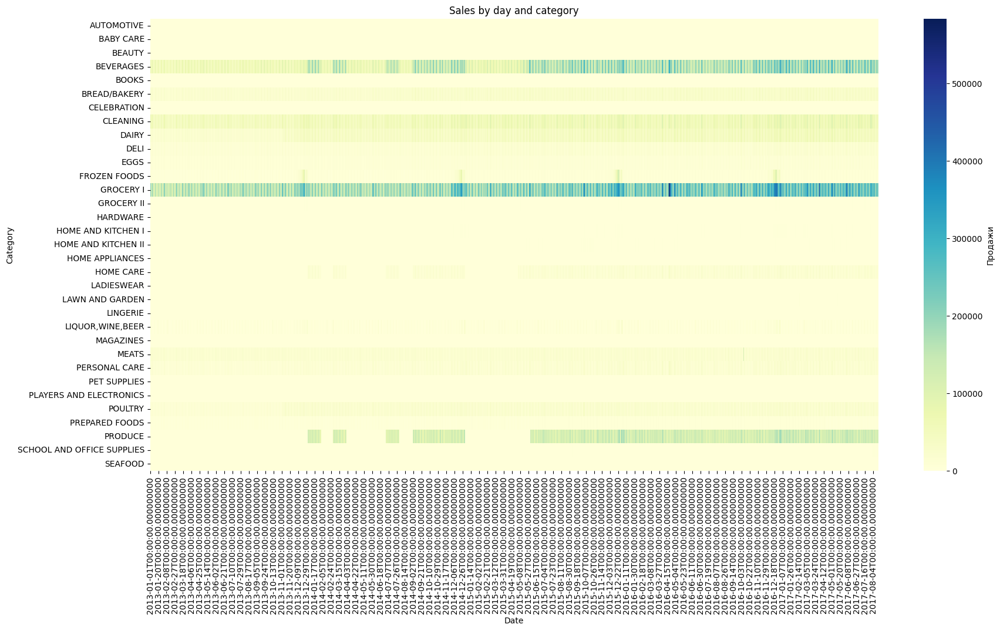
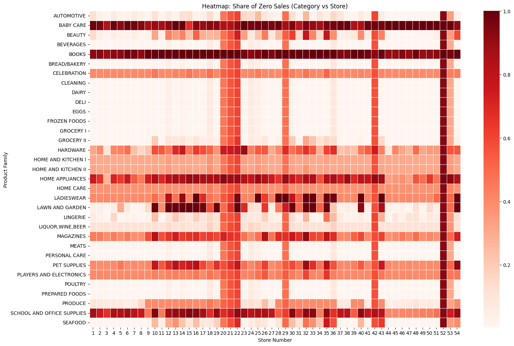
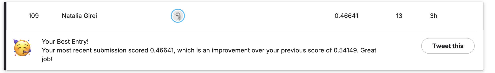

# Store-Sales-Time-Series-Forecasting
Time series forecasting of store sales using advanced machine learning algorithms
# Store Sales Time Series Forecasting

Time series forecasting of store sales using advanced machine learning algorithms.  
This project was developed as part of the [Kaggle competition](https://www.kaggle.com/competitions/store-sales-time-series-forecasting) with the goal of minimizing the RMSLE metric.

---

## Objective
- Build a predictive model for store sales.
- Incorporate seasonality, trends, promotions, and holiday effects.
- Achieve the lowest possible RMSLE score.

---

## Data
The dataset includes:
- Daily sales per store and product.
- Information about promotions.
- Calendar features (holidays, weekdays, etc.).
- Historical data over several years.

Data is available on Kaggle:  
[Store Sales - Time Series Forecasting Dataset](https://www.kaggle.com/competitions/store-sales-time-series-forecasting/data)

---

## Approach
1. **Exploratory Data Analysis (EDA)**
   - Identified seasonal patterns and long-term trends.
   - Analyzed the effect of promotions and holidays on sales.

Visualisation examples

2. **Data Preprocessing**
   - Removed irrelevant columns.
   - Encoded categorical features.
   - Created time-based features (year, month, day of week).

3. **Modeling**
   - Trained and compared: **XGBoost**, **LightGBM**, **CatBoost**.
   - Performed hyperparameter tuning using **GridSearch**.
   - Tested ensembling and stacking; however, these methods did not improve accuracy in this case.

4. **Results**
   - Best model: `XGBoost` with RMSLE ≈ *0.47530*.
   - Kaggle submission RMSLE = ≈ *0.46641*

   - Key insight: Feature engineering and single-model tuning yielded better results than complex ensembling.

---

## Technologies
- **Python**: Pandas, NumPy, Matplotlib, Seaborn
- **Machine Learning**: XGBoost, LightGBM, CatBoost, scikit-learn
- **Environment**: Google Colab

---

## How to Run in Google Colab
1. Open the Colab notebook:   
   

2. Upload the original datasets from Kaggle:
https://www.kaggle.com/competitions/store-sales-time-series-forecasting/data
